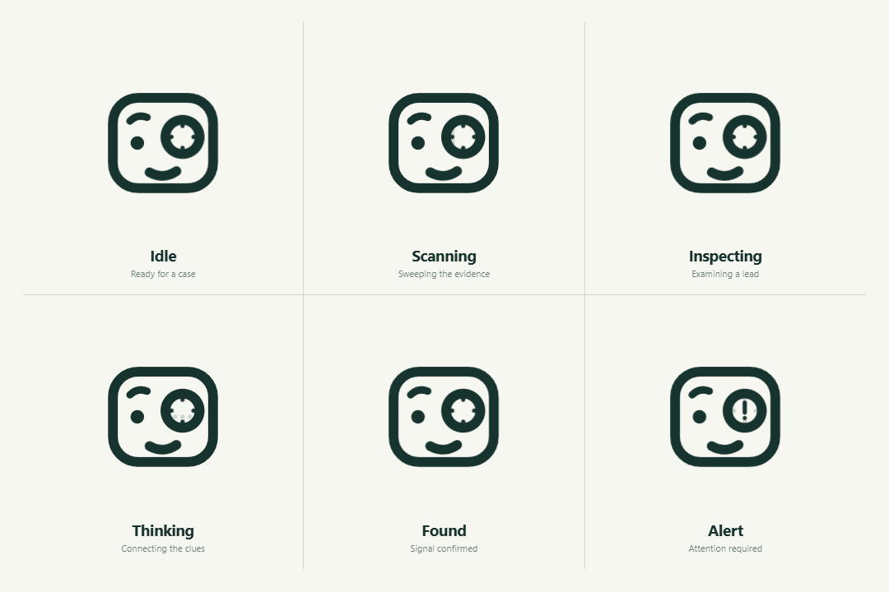

# test-share

Investigation workspace planning and reusable UI assets.

## Forensic agent

The investigation agent symbol includes six animated SVG states: **Idle, Scanning, Inspecting, Thinking, Found, and Alert**.



- [Animation assets and usage guide](forensic-agent/README.md)
- [Interactive preview](forensic-agent/index.html) — clone or download this repository, then open this file in a browser. No installation or build step is required.
- [Static original](forensic-agent/forensic-static.svg)
- [Individual animated SVGs](forensic-agent/svg)

The SVGs have transparent backgrounds, use a single configurable color, and support reduced motion. The preview provides state selection, pause/replay, playback speed, and light/dark backgrounds.

### Add to a page

```html

```

Switch the image source to the matching state as the agent progresses. Use `forensic-static.svg` when no animation is needed. See the [usage guide](forensic-agent/README.md) for inline SVG color and playback controls.

## Planning

[Investigation OS specification](splank)

This repository currently contains the planning document and the agent animation kit; an application implementation is not included yet.

## Evidence handoff

[September 28, 2026 external-evidence package](evidence-handoff/2026-09-28/README.md), with the supplied photograph removed, a checksum, and instructions for internal investigators.
